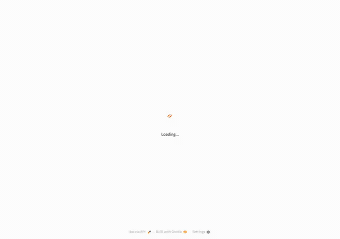

# Clinical Agent System
**Note**: Code access available on request

Intended to reduce physician/nurse administrative documentation burden --
not to diagnose or replace clinical judgment.

A multimodal clinical decision-support pipeline: given a patient record,
an LLM agent (GPT-5.6) decides which tools it needs — U-Net ultrasound
nerve segmentation, EHR-based 30-day readmission risk scoring (logistic
regression), RAG-grounded guideline retrieval, ICD-10-CM/HCPCS Level II
code lookup — then writes a SOAP-format draft note itself, with
Approve/Edit/Reject actions. Text generation is GPT-5.6's job throughout.
After the note is written, a separate SapBERT-based step (`src/code_linker.py`)
re-reads its own text and links it to ICD-10-CM codes by semantic
similarity.

It composes [`ultrasound-nerve-segmentation`](../ultrasound-nerve-segmentation)
(U-Net for brachial plexus nerve segmentation) as an independent tool,
wrapped as a standalone CLI (`tools/segment.py`) so the two repos stay
independently runnable.

## Demo



Real UI, real live agent run (recorded against `app.py` on localhost, not
a mock or a designed-then-scripted flow). It's a quick preview, not the
primary way to look at this — it plays at a fixed pace with no way to
pause. Run it yourself (below) to read at your own pace and try other
patients.

## Setup

Uses [`uv`](https://docs.astral.sh/uv/) — `uv sync` creates `.venv` and
installs everything in one step; `uv run` executes inside it without
separately activating it.

```bash
uv sync
cp .env.example .env   # fill in OPENAI_API_KEY and SEGMENTATION_CHECKPOINT
```

`SEGMENTATION_CHECKPOINT` should point to the `unet_best.pth` saved by
`../ultrasound-nerve-segmentation/src/train.py`. `segment.py` needs that
repo checked out as a sibling directory.

## Run it

```bash
uv run python app.py                                  # Gradio UI, localhost:7860
uv run python run_patient.py --patient-id demo-001     # CLI, prints the summary
```

Pick a patient, click **Generate SOAP note**. The draft appears with
Edit/Approve/Reject actions and a **Suggested codes** panel underneath
(SapBERT-matched ICD-10-CM codes, each shown with its similarity
score and which line of the note it matched — the score is shown, not
hidden, since this matching has a real, documented false-positive risk on
short/generic clauses); the segmentation panel on the right shows the
predicted nerve region (`demo-001` ships with a real Kaggle test image).
Expand **Technical details** for the guardrail verdict, judge score,
token/cost breakdown, and the full tool-call trace (including retrieved
guideline/code chunks, shown as a numbered source list). Runs the real
agent live — real OpenAI API calls, a few cents per click, not a replay.

```bash
uv run mlflow ui   # full observability dashboard: latency, cross-run cost/guardrail history
```

Opens at `http://127.0.0.1:5000`, but **lands on the "Default" experiment,
which is always empty** — every run here logs under the
`clinical-agent-system` experiment instead. Click it in the left sidebar
to see actual runs; this trips people up, worth knowing before assuming
the dashboard is broken.

## Layout

```
├── app.py                 <- Gradio UI
├── run_patient.py         <- CLI entry point
├── pyproject.toml         <- deps (uv) -- `uv sync` to install, `uv run ...` to execute
├── tools/
│   └── segment.py          <- wrapper over the trained U-Net checkpoint (called by the agent)
├── src/
│   ├── agent.py             <- the 4-tool agent + guardrail/judge orchestration; GPT-5.6 writes the note directly
│   ├── retriever.py          <- hybrid retrieval (Chroma dense + BM25 sparse, fused via RRF)
│   ├── code_lookup.py         <- ICD-10-CM/HCPCS Level II suggestion (RAG, agent-called mid-generation)
│   ├── code_linker.py          <- SapBERT entity linking (ICD-10-CM only), over the finished note
│   ├── risk_model.py           <- illustrative 30-day readmission risk (logistic regression)
│   ├── etl_mimic.py             <- MIMIC-IV demo -> per-admission feature table
│   ├── guardrail.py              <- fail-closed faithfulness gate (binary)
│   ├── judge.py                   <- LLM-as-judge faithfulness score (continuous)
│   ├── observability.py            <- MLflow cost/token/cache-rate tracking
│   ├── eval_retrieval.py            <- golden-set retrieval metrics
│   └── eval_generation.py            <- faithfulness + answer relevancy over live runs
├── scripts/download_mimic_demo.sh  <- pulls the open-access MIMIC-IV demo dataset
├── data/
│   ├── guidelines/, codes/, eval/    <- source corpora (tracked in git)
│   ├── stub_patients.json             <- demo patient records (tracked)
│   └── mimic_demo/                     <- downloaded dataset (gitignored)
└── docs/                                <- architecture, development log, evals detail
```

### MIMIC-IV demo data

```bash
./scripts/download_mimic_demo.sh
uv run python src/etl_mimic.py
```

Pulls the **MIMIC-IV Clinical Database Demo** (~100 de-identified
patients, open access, no PhysioNet credentialing needed — full MIMIC-IV
requires CITI training and is out of scope here).

## Metrics

| | Result |
|---|---|
| Retrieval (golden set, 14 queries) | hit_rate 1.000, MRR 0.964, NDCG@3 0.974 |
| Generation faithfulness (judge) | demo-001: 0.97, demo-002: 0.87 |
| Generation answer relevancy | demo-001: 0.75, demo-002: 0.78 |
| Readmission risk model, 5-fold CV AUROC | 0.594 ± 0.090 (weak — honestly reported, ~53 positive events) |
| Segmentation on real Kaggle test images (5 frames) | 3/5 positive detections; `demo-001`'s image: 2.57% area, 0.956 mean confidence |
| SapBERT code linking on both stub patients (post-fix) | demo-001: 1/1 correct match; demo-002: 4/4 correct matches |
| Cost to verify the whole system live | $0.051 |

Full methodology and how each number was produced:
[`docs/evals.md`](docs/evals.md). Dashboard structure (clinical
safety / pipeline health / economic efficiency) and how to read the
tool-call trace and MLflow: [`docs/observability.md`](docs/observability.md).

## Known gaps

- **No chat interface.** Built, then reverted — see
  [`docs/architecture.md`](docs/architecture.md#why-no-chat-interface).
- **Guardrail false-positive on negative/absence claims** (e.g. "X was not
  performed") — real, observed limitation, not yet fixed. See
  [`docs/development-log.md`](docs/development-log.md).
- **No PHI/PII leakage guardrail, no dosage-specific safety check** —
  deliberately not built; no real PHI or medication data exists in this
  project to honestly test either against. See
  [`docs/architecture.md`](docs/architecture.md#known-gaps-in-the-safety-layer).
- **No explicit LangGraph `StateGraph`** — uses a free-form tool-calling
  loop (`create_agent`) instead of the auditable state machine the
  original architecture doc recommended for a real clinical setting.
- **Code corpus is 5 codes**, ICD-10-CM/HCPCS Level II only (CPT excluded
  — AMA-copyrighted). Illustrative, not authoritative or complete.
- **SapBERT code linking (`src/code_linker.py`) is ICD-10-CM only**, not
  ICD-10-CM/SNOMED. SNOMED entries were tried and dropped: they duplicated
  ICD-10-CM coverage already in the vocabulary without adding anything,
  and one (knee osteoarthritis) repeatedly false-matched unrelated
  clauses in live testing (e.g. "and significant pulmonary disease" at
  0.35 similarity — no real relationship to knee OA). Two other
  vocabulary entries (an HCPCS nerve-block-pump code, and an ICD-10-CM
  myocardial-infarction code) were removed for the same kind of reason:
  live testing showed them acting as systematic false-attractor matches
  on unrelated text, not something a threshold tweak fixed. Full story in
  the file's own docstring.
- **Guideline corpus** (`data/guidelines/`) is a handful of summaries
  written for this project, not a licensed knowledge base.
